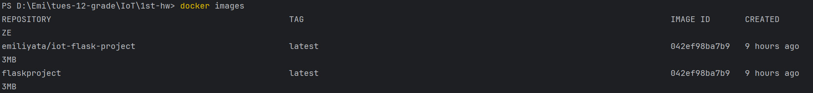
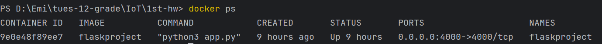

# Контейнеризация чрез Docker
## Малко домашно №1, Вариант №2

Условие на задачата: Docker_var2.pdf

### Oписание на стъпките за създаване на image и стартиране на контейнер.

1. Създаване на requirements.txt

Контейнеризацията, представляваща енкапсулацията на някакъв софтуер, предоставя удобство,
защото се създава среда за софтуера с всички нужни dependency-tа, библиотеки и т.н. нужни за изпълнението
на програмата успешно.

Затова създавам requirements.txt, използвайки командата:
```bash
pip freeze > requirements.txt
```
Този начин ми беше удобен предвид факта, че за ide използвах PyCharm
и създадах virtualenv. В файла се записват библиотеките, както и техните версии, използвани в проекта.

2. Създаване на image

С Dockerfile се build-ва image. В него се описват всичките необходими build steps:  
- Първо се подава съществуващ image (от DockerHub - публично хранилище, Dockerhub за Docker е малко като GitHub за Git) на операционна система, на която има python.
```bash
FROM python:3.9-slim-buster
# lightweight linux os with python installed
```
- Създава се папка (work directory) в контейнера, в която ще бъде приложението.
```bash
WORKDIR /app
```
-  Преди да се копира цялото приложение в image на отделна стъпка копирам само requirements.txt.
```bash
COPY requirements.txt requirements.txt
#copy requirements.txt into the image
```
- С вече създадения requirements файл и pip (който имаме от python image свален в първата стъпка), се инсталират нужните модули (библиотеки)
```bash
RUN pip install -r requirements.txt
# pip installs modules into the image
```
- Всичко от текущата папка на целият проект се копира в workdir /app, създаден във втората стъпка.
```bash
COPY . .
# adding source code into the image (all files in the working directory)
```
- Стартиране на приложението в контейнер image с:
```bash
CMD ["python3", "app.py"]
```
3. Стартиране на контейнер

- С описаните building steps в Dockerfile, може да се build-не image, с командата (сложен е и tag за име):
```bash
docker build --tag flaskproject .    
```
Проверка дали е създаден image с:
```bash
docker images 
```

- Създаване и стартиране на контейнер - порта на машината:порта на контейнера (посредством Nat да се препраща интернет трафик)
```bash
docker run --name flaskproject -p 4000:4000 flaskproject
```
Проверка дали контейнера е running с:
```bash
docker ps
```


4. Push-ване в Dockerhub

- Влизане в акаунта 
```bash
docker login -u emiliyata        
```
- Слагане на tag на контейнера
```bash
docker tag flaskproject emiliyata/iot-flask-project
``` 
- Push-ване в repo Iot
```bash
docker push emiliyata/IoT:flaskproject  
```

DockerHub: https://hub.docker.com/repository/docker/emiliyata/iot-flask-project/general
