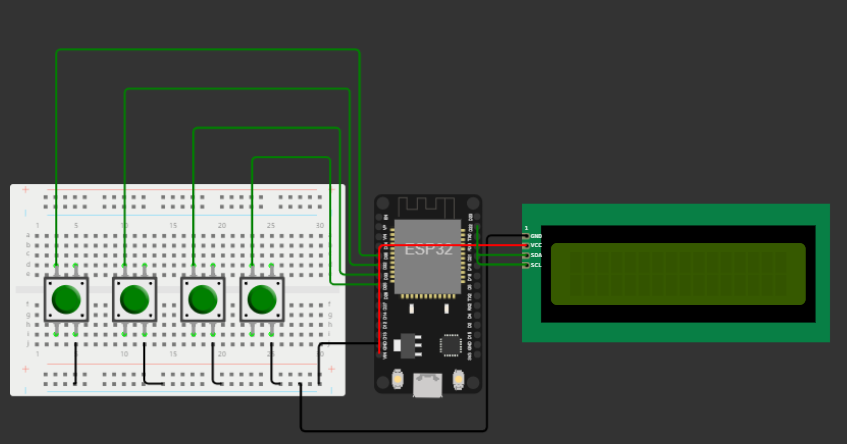

# Емилия Чукалева 12Г №9
Оценката, за която се претендира е 6.

## Линкове към проекта:

- Проект със звънците: https://wokwi.com/projects/386851545134585857
- Проект с бутоните: https://wokwi.com/projects/386887172034033665

## Информация за използваните topic-и
 - Име на topic-а: buzzer-to-activate
 - Формат на съобщенията: "Pressed button: {№ на бутона}" Например: Pressed button: 2

## Информация за използваните компоненти

- Buzzers

Има два извода един от които за земя и другия за получаване на сигнал.
В първия проект със звънците, пиновете за сигнал (червените) на бъзерите от 1 до 4 са свързани съответно на пинове: 12, 14, 27, 26. Пиновете за земя са свързани към земята на микроконтролера. Използван е PWM (Pulse width modulation), като честота на сигнала определя височината на генерирания звук.
- LCD дисплей (16x2)

Има четири извода, два за захранване и земя и два за I2C комуникация - SCL (serial clock line) и SDA (serial data line).
SCL и SDA пиновете на дисплея са свързани към 22 и 21 пин на микроконтролера. Така се реализира I2C комуникация между дисплея и ESP32. Диспеят се захранва като VCC пинът му е свързан към VIN на микроконтролера, а GND към GND, за да имат обща земя.
На дисплея, в проекта за бъзерите, се изписва колко дълго време още ще звъни съответния звънец, а в проекта с бутоните
се визуализира информация, когато съобщение е публикувано, изписва се потвърждение, както и самото съдържанието на съобщението

- Pushbuttons

Двата сигнала, които се подават на четирите бутона, трябва да бъдат свързани на кръст. Към единия пин се подава земя от микроконтролера, а на другия, по диагонал, цифров сигнал. Пиновете на четирите бутона са съответно свързани към: 35, 32, 33 и 25 пин на ESP32. Бутоните представляват входна информация за контролера.
Отчита се когато бутон бъде натиснат, за да се изпрати съобщение към другия проект, и съответният бъзер да бъде активиран.
