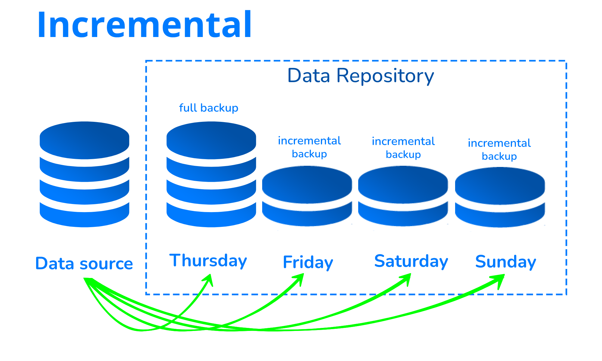
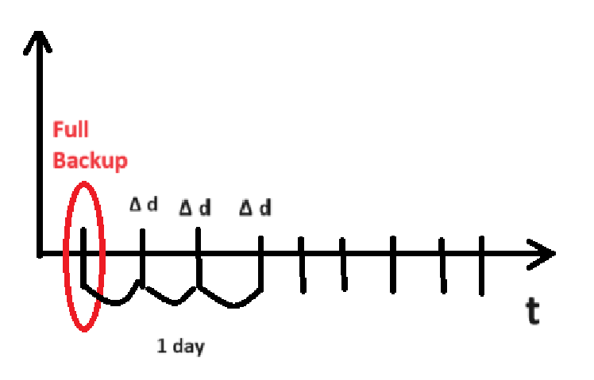

# ВОТ - Виртуализация и облачни технологии

lyubomir.stoyanov@oblak.bg

1. [Какво е виртуализация?](#Какво-е-виртуализация)
2. [Защо виртуализацията е важна?](#Защо-виртуализацията-е-важна)
3. [Основни концепции за виртуализацията](#Основни-концепции-за-виртуализацията)
4. [Контейнеризация](#Контейнеризация)
5. [File Block и Object storage](#File-Block-Object-storage)
6. [Мониторинг](#Мониторинг)
7. [Elastic Search](#Elastic-Search)
8. [Backup и Архивиране](#Backup-и-Архивиране)

## Какво е виртуализация?
Виртуализацията като технология позволява да бъдат създадени виртуални
репрезентации на сървъри, storage, networks и други физически машини. 

Виртуалният софтуер пресъздава функциите на физическия hw, което позволява няколко (n на брой) виртуални машини
да работят едновременно на една физическа машина.

Виртуализацията се използва с цел хардуерните ресурси да се използват по-ефективно. Затова съществуват cloud computing services, които менажират инфраструктурата по-ефикасно.

## Защо виртуализацията е важна?
Виртуализацията предоставя много повече възможности за взаимодействие с някакъв хардуерен ресурс.

Физическите сървъри консумират:
- Електричество
- Storage space (Пространство)
- Нуждаят се от поддрържа - конфигурации и тн.

Виртуализацията премахва тези ограничения като прави ***абстракция*** на
функционалностите на физическия hw в софтуер.

*Например:* Комапния има нужда от сървъри с три функции:
- Store business email securely 
- Run a customer-facing application 
- Run internal business applications

Всяка една от тези функционалности изисква различни ресурси
- За първата (email application) е нужно: more storage capacity & Windows OS
- За втората (customer-facing application) е нужно: Linux OS & high processing power to handle large volumes of website traffic
- За третата (internal business application) е нужно: iOS & more internal memory (RAM)

***Efficiant hw use***

Вместо да бъдат използвани три различни сървъра с виртуализация могат да бъдат създадени три дигитални сървъра (виртуали машини) само на един физически сървър.

***IaaS***

Компанията може да използва cloud instance или VMs от cloud computing provider (АWS, Azure, Google Cloud). 
AWS manages all the underlying hardware, and the company can request server resources with varying configurations. 
All the applications run on these virtual servers without the users noticing any difference.

[Qemu](https://en.wikipedia.org/wiki/QEMU) - първа имплементация (най-дъртото)

[KVM -  Kernel-based VM](https://en.wikipedia.org/wiki/Kernel-based_Virtual_Machine)

## Основни концепции за виртуализацията

*Отново понятие за виртуализация:* Процес, който позволява hw ресурси да се споделят, използват едновременно от различни, отделени една от друга среди.
Всяка виртуализирана среда използва разпределените за нея ресурси като:
- Memory
- Processing power
- Storage

### VM & HV 

#### Виртуална машина

Виртуалната машина е софтуерно-дефиниран компютър, който работи върху физическо компютър, с отделена ОС и компютърни ресурси.
- физическият компютър е *host* машината
- VM е *guest* машината

VMs са абстрахирани от компютърния hw чрез хипервайзор.

#### Хипервайзор

Хипервайзорът е софтуер, който менажира VMs на компютър.
HV прави абстракция на hw ресурси, така че всяка VM да получи разпределените за нея ресурси и по никакъв начин да не се намесва в работата на другите VMs.

Хипервайзорът прави виртуалзацията възможна.

Има два типа HV (два типа на пълна виртуализация):
- Тип 1 HV (bare metal HV)

hv - overlay - псевдо ОС (междинен слой между BIOS и guest OSs)

липсва ОС на хоста => Директно се достъпват ресурсите на машината. Кърнълът има само функции за виртуализация 

Примери: KVM, ESXi, MS Hyper-V
- Tип 2 HV 

на хоста има ОС => HV минава през ОС на хоста, за да достигне до hw.
Също така ОС на host-a приоритизира своите функции и апликации отколкото тези на VM.
=> Процесите са по-бавни и по-малко ефикасни със сравнение с тип 1. Повече latency.

тип 2 hv е инсталиран върху ОС

Примери: Oracle VM Virtual Box, VMware Workstation

KDM - единствената виртуализация, която не се квалифицира в тип (може да е и 1, и 2)

Latency - колко време отнема изпълняването на команда (изпълняване и връщане на отговор)

Може да се направи така, че да се прескочи layer на kernel-ът (промяна на prefix: -1  в execution stake) т.е. VM да прескочи layer при виртуализация тип 2 и по този начин да се намали latency (да е бърза като тип 1, да локира и да чете)
### Диспечер на задачите в linux
За изолиране на процесите в linux системи има 2 функционални модула:

#### [Cgroups & Namespaces](https://www.nginx.com/blog/what-are-namespaces-cgroups-how-do-they-work/)

- Control groups - cgroups

Менажират и ограничават системните ресурси (като CPU, memory, netw bandwidth и др.) за различни групи от процеси.
Контрол групите имат йерархична структура

- Namespace

Основна функция: *Да изолират процесите един от друг*

Предоставят процес със своя собствена изолирана среда

Различни типове в Linux:
- Mount: isolates a process’s view of the filesystem 
- PID: isolates a process’s view of the process tree 
- Network: isolates a process’s view of the network stack 
- User: isolates a process’s view of user and group IDs

Те често се комбинират със cgroups, за да осигурят изолиране на контейнерите и управление на ресурсите.

## Контейнеризация

Контейнеризацията, представляваща енкапсулацията на някакъв софтуер, предоставя удобство,
защото се създава среда за софтуера с всички нужни dependency-tа, библиотеки (DDL - dynamic link library) и т.н. нужни за изпълнението
на програмата успешно.

При контейнеризацията ако kernel-ът падне всичко пада. Тясна зависимост с host-а.
Различава се от пълната виртуализация, деляща се на тип 1 и тип 2.

Контейнерите са на основата на механизма на LXC, но са по-user-friendly. Основна цел: за миграция, да могат да бъдат преместени върху инфраструктурата на друга операционна система или друга среда.
Контейнерът е по-бърз, защото е малък.

Виртуализацията поддържа изпълнението на множество операционни системи на един физически сървър, докато контейнеризацията поддържа внедряването на множество приложения, разработени в средата на една операционна система, разположена на една виртуална машина или сървър.

С Dockerfile се build-ва image. В него се описват всичките необходими build steps:  
- Първо се подава съществуващ image (от DockerHub - публично хранилище, Dockerhub за Docker е малко като GitHub за Git) на операционна система, на която има python.
```bash
FROM python:3.9-slim-buster
# lightweight linux os with python installed
```
- Създава се папка (work directory) в контейнера, в която ще бъде приложението.
```bash
WORKDIR /app
```
-  Преди да се копира цялото приложение в image на отделна стъпка копирам само requirements.txt.
```bash
COPY requirements.txt requirements.txt
#copy requirements.txt into the image
```
- С вече създадения requirements файл и pip (който имаме от python image свален в първата стъпка), се инсталират нужните модули (библиотеки)
```bash
RUN pip install -r requirements.txt
# pip installs modules into the image
```
- Всичко от текущата папка на целият проект се копира в workdir /app, създаден във втората стъпка.
```bash
COPY . .
# adding source code into the image (all files in the working directory)
```
- Стартиране на приложението в контейнер image с:
```bash
CMD ["python3", "app.py"]
```
## File Block Object storage

## Мониторинг
Биват събирани метрики на различни показатели. Например (CPU, RAM, Storage, LAN). Изключително полезно е за мониториране на инфраструктурата, мрежата - трафикът, приложенията и други.
Чрез наблюдението, може да се разбере дали има overload на накой компонент.
 - Troubleshooting
 - Measurable (скалируемост)
 - Historical Data (В продължителен период от време да се извършва мониторинг)
 - Reactivity (Notifications -> Alert Manager)
 - Reliability

Начин за извличането на метрики е чрез node exporter, който да изпраща данни на мониторинг системата. Node Exporter агент, който събира системни метрики и ги представя във формат, който може да бъде приет от Prometheus.
Prometheus, Grafana и Node Exporters често се използват заедно в Kubernetes за наблюдение на приложенията на системно ниво. Тези инструменти предоставят статистически данни за nodes и контейнери, които позволяват на разработчиците да анализират в реално време метриките на nodes и контейнери. Prometheus Node Exporter може да се използва по-конкретно за получаване на метрики на nodes. 

Prometheus Exporter може да извлича (fetch) статистически данни от дадено приложение във формат, използван от системата (т.е. XML), да преобразува тези статистически данни в метрики, които Prometheus може да използва. Повечето клъстери на Kubernetes излагат метрики на ниво клъстер и метрики на ниво контейнер. Не се предоставят обаче метрики на ниво node.

Prometheus Node Exporter предоставя системни метрики на ниво хардуер и операционна система, изложени от ядрата на *NIX чрез метрични колектори (metric collectors). Node Exporter измерва множество метрики, като например:

- Memory: RAM total, RAM Used, RAM Cache, RAM Free
- Disk:	Disk Space, IOPS, Mounts
- CPU:	CPU Load, CPU Memory Disk
- Network:	Network traffic, TCP flow, Connections

Collector-ът e част от exporter. Представлява код, написан за събиране на данни за дадена метрика, пример за метрика е "CPU core usage" или набор от метрики. Следователно колекторите също представляват метрика или набор от метрики.


### Active и Passive Monitoring
Пример с докторите :{

Active - Нарича се още "синтетичен", защото този подход не не използва реални потребителски данни.Вместо това инструментите, използвани при този вид мониторинг, имат за цел да предскажат потенциалната производителност, като използват симулации на текущото поведение на мрежата. Симулациите се генерират във всички системи и хардуер от край до край.
Може да се симулира голям трафик или други сценарии с цел изследване. Тъй като активният мониторинг предоставя резултати въз основа на прогнозни данни, той може не винаги да докладва точни резултати, тъй като използва симулации вместо действителни данни за потребителя. Друг недостатък на този подход е, че той натоварва ресурсите, тъй като непрекъснато произвежда данни в реално време.

Pros of active monitoring
- Allows you to see potential problems before it affects network users.
- Provides real-time network visibility.
- Simulates possible user behaviors.
- Enables your team to predict and troubleshoot potential issues.

Cons of active monitoring
- Resource-intensive approach.
- Data isn’t always accurate.

Passive - Включва пасивен анализ и се основава на действителни данни от потребителите на мрежата. Може да се използва пасивен мониторинг за анализ на трафика на потребителите и тенденциите, възникващи в мрежата. При този подход може да се извлича информация за конкретни мрежови връзки и да се разглеждат поотделно. Може също така да се обединяват набори от данни според определени периоди, което позволява да се анализират тенденциите в мрежата и да се коригират капацитет, брой и видове необходими ресурси.

Pros of passive monitoring
- Uses actual user data.
- It doesn’t require the use of other networks or external traffic.
- Data is pulled from specific network points.
- Provides you with a holistic view of total network performance.
- You can use it to focus on and measure particular metrics.
- Uses more significant amounts of network performance data, which makes it more accurate.

- Cons of passive monitoring
- You need to keep your passive monitors fully updated.
- This approach will require specialized hardware to thoroughly analyze user experiences on specific devices.
- Any issue that you discover through this approach must be addressed right away.

Като се съчетаят active и passive е най-добре, защото като и от двете се събира информация, много бързо може да се идентифицира къде има проблем (примерно).

## Elastic Search
Elastic Search е база данни, която се използва за търсене на данни. Тя е написана на Java и е open source, работи с JSON документи. Тя е базирана на Apache Lucene и е разработена от Elastic. Използва се най-често за логове и анализиране на данни.

### Писане на логове - за trace-ване на activity

Log-овете са обикновено в следния формат:

```
[timestamp][log_level][action][invokes][stacktrace][message]
```

Като има два стандарта за log level severity (един правилен и един грешен)

- Linux (0-9)
- Windows - (0-7)

Идеята за Elastic Search е дошла от нуждата да се избегне четене на стотици log файлове (от Oracle)

Ползват библиотека на Apache (Lucene) и така създават Elastic Search

Elasticsearch – база данни, за работа със документи със текстова информация

ELK stack - за log analytics, SIEM 
- Logstash – централизиран интерфейс за работа с Elastic Search, вкарва документи в базата данни; много усъвършенстван аргумент (като агент се инсталира и събира цялата смет, като collector и изпраща на Elastic Search)
- Kibana – визуализация на данните от Elastic Search, визуално предава инфото събрано от logstash; много силен инструмент за визуализация

Примерен log:

```
2022-03-22  16:11:032  ERROR  “nullpointerexception”  “opa!”
0-9
```

### Каква е идеята за Elastic Search?

- Elastic search ползва нещо като нерелационна база данни – търси бързо по определен критерий. Hash Map - key-value. На база на timestamp (не се повтаря) се генерира key.
- В нерелационна БД се наслагва друга такава, в нея също и т.н -> демек придобива структура и леко заприличва и на релационна :{

```
----------------------------------------------------
| id | timestamp | severity | stacktrace | message |
----------------------------------------------------
| 0 | 2022-03-22 |  ERROR   |   NULLPE   |  opa!  |
|   |  16:11:32  |          |            |         |
----------------------------------------------------
```

- Извеждаме `severity` в друга таблица – там са само 9 записа константно, спестяваме памет. Дървовидна структура
- Вместо горното, може да ползваме граф - имаме корен, чиито деца са severity, чиито деца са обекти - хеш таблици, в които има pointer към графи за stacktrace и message (един за всички hashtable-и) като value, а като ключ - timestamp. Така скоростта на търсене в граф е O(log(n)), а за hashtable - O(1)
- Ако искаме повече полета, ползваме още графове
- Бързо и линейно търсене -> много дървета-> данните се разбиват на структури от данни
- Elastic Search има много алгоритми за обработка на език и запазва само най-есенциалното, като няма информационен излишък
- За да се възстанови наново изречението, както е било (с информационен излишък) се ползва математически модел на езика

Може да се добавят графове - Binery Tree, indexed (за обща култура) 
## Backup и Архивиране

### Какво е Backup?
В най-общия случай това е копие на определено количество от данни, съхранявана на друго място. Създават се резервни копие за защита на данните или възстановяване на оригинала от даден период от време.

### Видове backup
**Full backup** - представлява копие на целия набор от данни. Въпреки, че се счита за най-надеждния метод за архивиране, извършването на full backup отнема много време и ресурси. Повечето организации извършват пълни резервни копия само периодично. Това не означава правене на full backup много рядко (веднъж годишно например), защото процеса по възстановяване на данните (restore) се бави.


**Incremental backup** - алтернатива на пълното архивиране, като архивира само данните, които са се променили след последния full backup. Използва се формулата **Δd = data / data'**, като: data e редактираната информация, а data' е full backup.


 
AWS S3 Backup - различни възможности май май - incremental backup
    S3 Glacier ?

**Differential backup** - копира данни, променени след последното пълно резервно копие. Това дава възможност за по-бързо пълно възстановяване, като се изисква само последното пълно резервно копие и последното диференциално резервно копие. 


### Други термини

**Retention time** - периода между два full back

**Recovery point objective (RPO)** - се определя като максималното количество данни - измерено във времето - което може да бъде загубено след възстановяване от бедствие, повреда или сходно събитие, преди загубата на данни да надхвърли допустимото за организацията.

**Recovery time objective (PTO)** - максималното приемливо време, през което дадено приложение, компютър, мрежа или система може да не работи след неочаквано бедствие, повреда или подобно събитие.


# Archive
- Физически архив -може да се извади един документ - едно копие
- За разлика от backup -> не се пази стара версия, а само последно променяната версия
- Могат да се правят instant changes
- Организираност

### Съхраняване на HDD

+ Място - Около 1 TB
+ Живот - до 5 години живот
+ Бързина - Бързо

### Съхраняване в облачно пространство

+ Amazone Web Services (AWS) -> S3 backup -> S3 Glacier

  S3 Glacier storage класовете осигуряват практически неограничена мащабируемост и са проектирани за трайност на данните. Класовете за съхранение S3 Glacier предоставят възможности за най-бърз достъп до архивираните данни и най-евтиното архивно съхранение в облака.

  Има три класа за съхранение на архиви, оптимизирани за различни модели на достъп и продължителност на съхранение.
  + **S3 Glacier Instant Retrieval storage class**- lowest cost storage with milliseconds retrieval
  + **S3 Glacier Flexible Retrieval** -  retrieval in minutes or free bulk retrievals in 5-12 hours
  + **S3 Glacier Deep Archive** - the lowest cost storage in the cloud with data retrieval within 12 hours

### Съхраняване на видео касети

+ Място - Около 8 TB 
+ Живот - до 35 години живот
+ Бързина - Отнема време


Записки за Backup и Archive от Плами :)